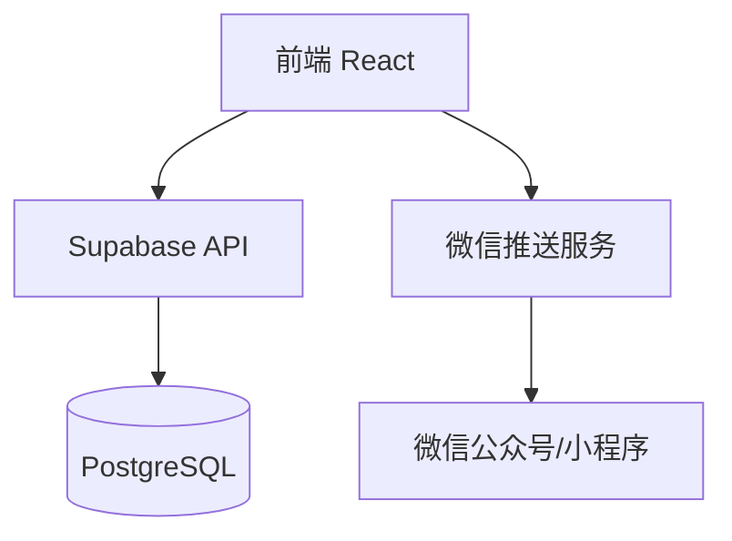

## 1. Architecture Design


## 2. Technology Description
- **Frontend**: React@18 + TypeScript + TailwindCSS@3 + Vite
- **Backend**: Supabase (Auth, Database, Storage)
- **Message Push**: 微信公众号消息推送
- **State Management**: Zustand

## 3. Route Definitions
| Route | Purpose |
|-------|---------|
| / | 首页 - 菜品浏览 |
| /order | 点菜页 - 选择菜品 |
| /inventory | 清单页 - 食材管理 |
| /history | 订单历史 |
| /settings | 设置页 |

## 4. API Definitions
### 4.1 菜品接口
- `GET /api/dishes` - 获取菜品列表
- `POST /api/dishes` - 添加新菜品
- `PUT /api/dishes/:id` - 更新菜品
- `DELETE /api/dishes/:id` - 删除菜品

### 4.2 订单接口
- `POST /api/orders` - 创建订单
- `GET /api/orders` - 获取订单列表
- `PUT /api/orders/:id` - 更新订单状态

### 4.3 食材接口
- `GET /api/ingredients` - 获取食材库存
- `PUT /api/ingredients/:id` - 更新库存数量

## 5. Data Model

### 5.1 ER Diagram
```mermaid
erDiagram
    DISH ||--o{ INGREDIENT : requires
    ORDER ||--|{ ORDER_ITEM : contains
    ORDER_ITEM }o--|| DISH : references

    DISH {
        id uuid PK
        name varchar
        category varchar
        description text
        image_url varchar
        created_at timestamp
    }

    INGREDIENT {
        id uuid PK
        name varchar
        unit varchar
        quantity float
        in_stock float
        created_at timestamp
    }

    ORDER {
        id uuid PK
        user_id uuid
        status varchar
        target_date date
        created_at timestamp
        updated_at timestamp
    }

    ORDER_ITEM {
        id uuid PK
        order_id uuid FK
        dish_id uuid FK
        quantity int
    }

    DISH_INGREDIENT {
        dish_id uuid FK
        ingredient_id uuid FK
        amount float
        PRIMARY KEY (dish_id, ingredient_id)
    }
```

### 5.2 DDL Statements
```sql
CREATE TABLE dishes (
    id UUID PRIMARY KEY DEFAULT uuid_generate_v4(),
    name VARCHAR(100) NOT NULL,
    category VARCHAR(50),
    description TEXT,
    image_url VARCHAR(255),
    created_at TIMESTAMP DEFAULT NOW()
);

CREATE TABLE ingredients (
    id UUID PRIMARY KEY DEFAULT uuid_generate_v4(),
    name VARCHAR(100) NOT NULL,
    unit VARCHAR(20) NOT NULL,
    quantity FLOAT NOT NULL DEFAULT 0,
    in_stock FLOAT NOT NULL DEFAULT 0,
    created_at TIMESTAMP DEFAULT NOW()
);

CREATE TABLE dish_ingredient (
    dish_id UUID REFERENCES dishes(id),
    ingredient_id UUID REFERENCES ingredients(id),
    amount FLOAT NOT NULL,
    PRIMARY KEY (dish_id, ingredient_id)
);

CREATE TABLE orders (
    id UUID PRIMARY KEY DEFAULT uuid_generate_v4(),
    user_id UUID REFERENCES auth.users(id),
    status VARCHAR(20) DEFAULT 'pending',
    target_date DATE NOT NULL,
    created_at TIMESTAMP DEFAULT NOW(),
    updated_at TIMESTAMP DEFAULT NOW()
);

CREATE TABLE order_items (
    id UUID PRIMARY KEY DEFAULT uuid_generate_v4(),
    order_id UUID REFERENCES orders(id),
    dish_id UUID REFERENCES dishes(id),
    quantity INT DEFAULT 1
);

GRANT SELECT ON dishes TO anon;
GRANT INSERT ON orders TO authenticated;
GRANT ALL PRIVILEGES ON ingredients TO authenticated;
```